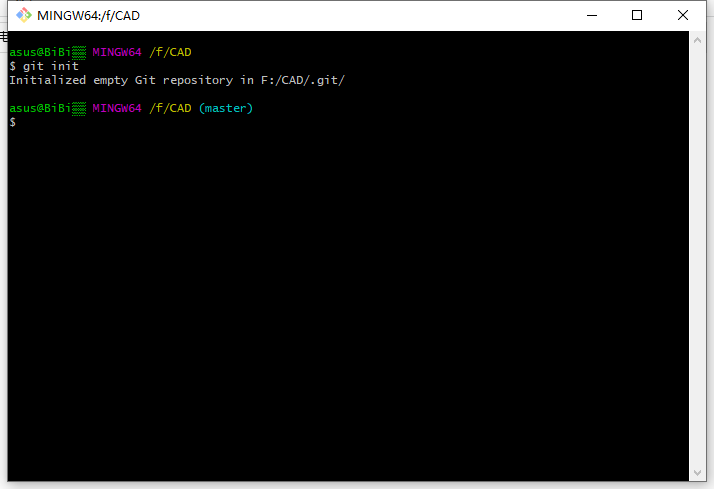
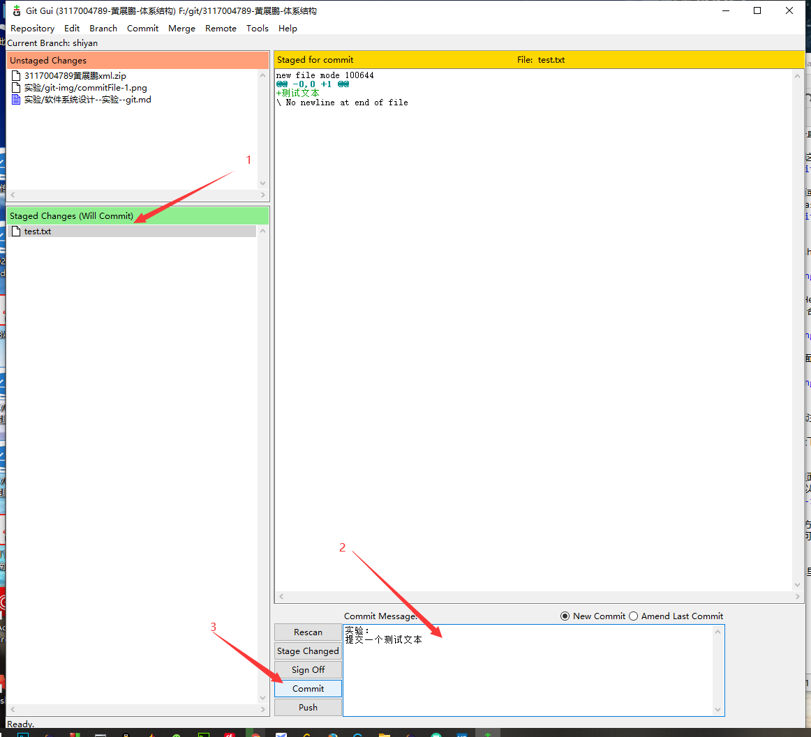

# 实验目的

 内容包括 Git 软件的安装和简单使用，比如 增加文件，提交，创建分支，增加远程，下拉、上推，合并等内容。

# 实验平台
windows 10 64位

# 实验前准备
新建一个文件夹，当做一个项目文件

# 实验内容

##下载Git
第一步：到Git官网https://git-scm.com/download/win直接下载对应的版本。安装过程一直选择默认配置即可

同时也可以下载一个GUI，我们这里使用内置的GUI

第二步：安装完成后，回到桌面或者某个文件，点击右键，如果有出现Git GUI Here和Git Bash Here就表明安装成功了

##开始使用Git
先在目录下右键，点击Git Bash Here，在Git命令窗口输入git init初始化本地仓库。

回到目录，右键点击Git Gui Here打开GUI面板。图片中已经介绍到部分常用功能（创建分支、合并分支、查看历史、提交）的按钮的位置

点击Edit----options，在里面输入UserName和Email Address

##增加文件并提交到本地仓库
在上面的Git GUI面板上已经标注了各部分区域的主要作用。

第一步：在打开Git GUI的目录下创建一个test.txt，内容是：测试文本

第二步：打开Git GUI或者在里面刷新一下，就可以看到如下图:左上方显示test.txt，右边可以看到test.txt的内容

第三步：将test.txt拉到左下方Staged Changes区域里，或者点击test.txt前面的标签，就可以将test.txt放到staged changes里。

注意：只有在Stagde Changes里的文件才会被提交

第四步：在右下方的文本框输入本次提交的附加内容（通常为描述提交内容）

第五步：点击旁边的commit

可以在Repositiry----Visualize master History中看到相关提交历史

注意：原有文件更改后也是可以进行提交的，不是必须新创建的文件。

##分支操作
###创建一个分支
步骤：Branch----Create，输入新分支的名字，选择创建该分支的主干/支干，点击create。

创建成功后在功能栏下方会显示当前分支的名字

###删除、重命名、切换分支
这些操作可以在Branch功能栏下轻易实现

Checkout：切换分支，切换前要先将当前分支的文件全部提交了
Rename：重命名
delete：删除

###分支合并
在目录下新建一个branchtest.txt文件用以测试。切换到shiyan--createBranch分支，提交该文件。

然后点击merge————Local merge————选择合并的分支/主干

注意：在合并前，一定要把更改的文件都提交了才可以进行合并，否则会报错。

##增加远程
在本地连接到github。首先需要自行在github注册账户https://github.com/。注册完成后按以下步骤

第一步：创建自己的SSH秘钥

第二步：生成key
在目录下右键点击git bash here————输入ssh-keygen -t rsa -C "你的注册邮箱"————输入cat ~/.ssh/id_rsa.pub————复制命令行输出的一串字符（以ssh-ras开头）————输入到第一步的key中————成功后如下图

第三步：在github上创建自己的存储库，查看存储库的URL地址

第四步：在Git GUI上————remote——add

成功后会显示Succes

##上推
添加了到github的连接后，点击右下方push————选择要上推的到github仓库————上推成功，中间可能还会弹出窗口需要登录到github，正常输入即可

##下拉
点击remote————fetch————选择连接的远程仓库————点击merge————local merge————可以看到有一个以远程仓库名开头的分支————选择merge————即可修改里面的内容

##合并

# 实验总结